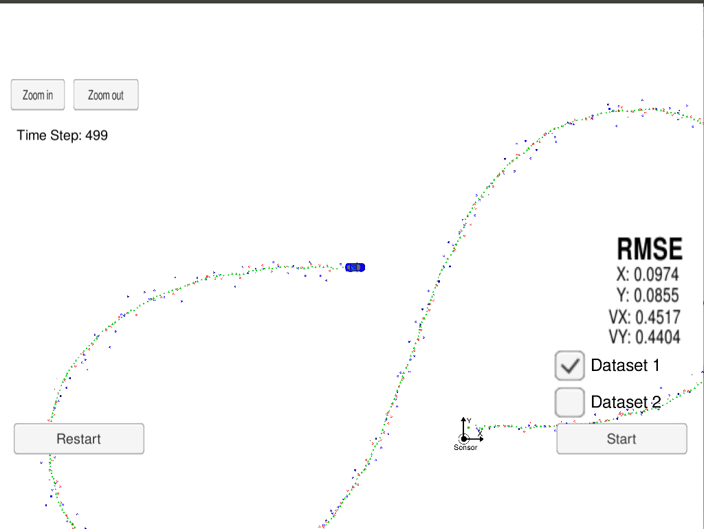
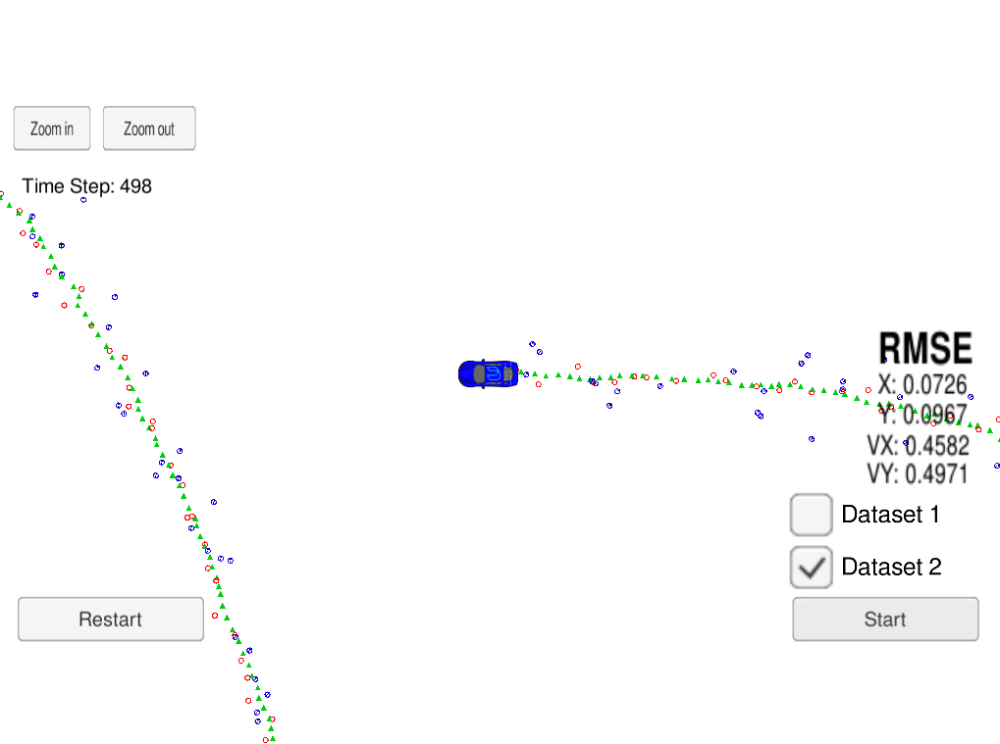

# Extended Kalman Filter

This project was done as a part of [Udacity's SDN](https://github.com/udacity/CarND-Extended-Kalman-Filter-Project). The goal is to use a EKF to fuse noisy lidar and radar data in order to estimate and track the state of a vehicle. [Udacity's simulator](https://github.com/udacity/self-driving-car-sim/releases) provides the noisy data

## Dependencies

* cmake >= 3.5
  * All OSes: [click here for installation instructions](https://cmake.org/install/)
* make >= 4.1 (Linux, Mac), 3.81 (Windows)
  * Linux: make is installed by default on most Linux distros
  * Mac: [install Xcode command line tools to get make](https://developer.apple.com/xcode/features/)
  * Windows: [Click here for installation instructions](http://gnuwin32.sourceforge.net/packages/make.htm)
* gcc/g++ >= 5.4
  * Linux: gcc / g++ is installed by default on most Linux distros
  * Mac: same deal as make - [install Xcode command line tools](https://developer.apple.com/xcode/features/)
  * Windows: recommend using [MinGW](http://www.mingw.org/)

## Build Instructions

1. Clone this repo.
2. Make a build directory: `mkdir build && cd build`
3. Compile: `cmake .. && make` 
4. Run it: `./ExtendedKF `

## Results

After running the EKF on dataset 1

Red circles are lidar measurements. Blue = radar measurements. Green = car's position estimated by the EKF.

After running the EKF on dataset 2

